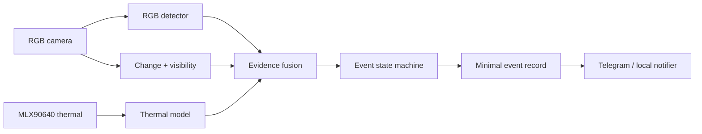

# VISIONSHIELD architecture

VISIONSHIELD is a local, multimodal evidence agent. It is intentionally modular: sensor adapters and model adapters produce typed observations, deterministic context modules qualify those observations, and a stateful fusion engine decides whether evidence is clear, a candidate, or confirmed.

## Runtime path

1. `FrameObservation` and `ThermalObservation` arrive with the same UTC timestamp.
2. Detector/model adapters return calibrated scores in `[0, 1]`.
3. Perimeter context checks whether the RGB centroid lies inside the configured polygon.
4. Visibility scales the RGB contribution instead of silently pretending the image is reliable.
5. `fuse_scores` calculates a transparent weighted score and records explanations for degraded or incomplete evidence.
6. `EventStateMachine` requires consecutive high scores before confirmation and clears after a low score.
7. Only confirmed evidence can create a deterministic, minimal event ID.
8. The configured notifier sends a plain-text alert only when the state changes into `confirmed` and the alert cooldown has elapsed.

## Extension points

The included passthrough adapters are deliberately dependency-free and deterministic. Replace them with implementations conforming to `RGBDetector` and `ThermalModel` when validated models and sensor adapters are available. Model weights, recordings, datasets, and databases remain excluded from Git.

## Design constraints

- The agent never invents detections, sensor values, metrics, or notifications.
- Mismatched timestamps are rejected rather than fused silently.
- Scores are bounded and configuration weights must sum to one.
- Event creation is blocked until the state machine reaches `confirmed`.
- Alert delivery is opt-in and never embeds credentials in source code.
- Alert cooldown prevents a sustained event from flooding the phone.
- Retention, consent, access control, and deletion must be implemented by the runtime consumer before deployment.
