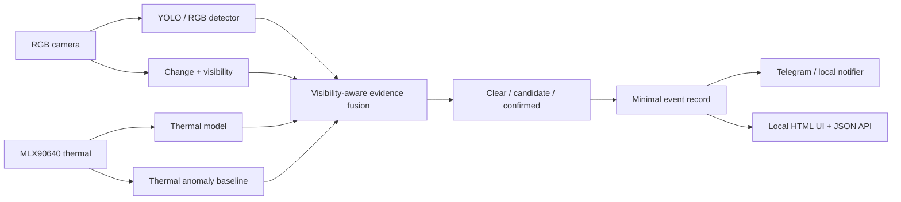

# VISIONSHIELD system architecture

VISIONSHIELD is a local multimodal evidence agent. Sensor adapters and model adapters produce typed observations; deterministic context modules qualify them; a stateful fusion engine decides whether evidence is clear, a candidate, or confirmed.

## Runtime invariants

1. RGB and thermal observations must share a UTC timestamp.
2. Model scores stay in `[0, 1]`; fusion weights sum to one.
3. A perimeter decision is explicit and reports whether a polygon is configured.
4. RGB reliability is reduced when visibility is poor.
5. Confirmation requires consecutive evidence; alert cooldown prevents flooding.
6. No event is created before `confirmed`.
7. YOLO weights, datasets, recordings, and credentials remain outside Git.
